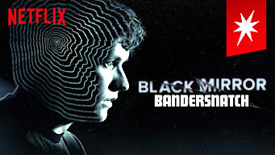
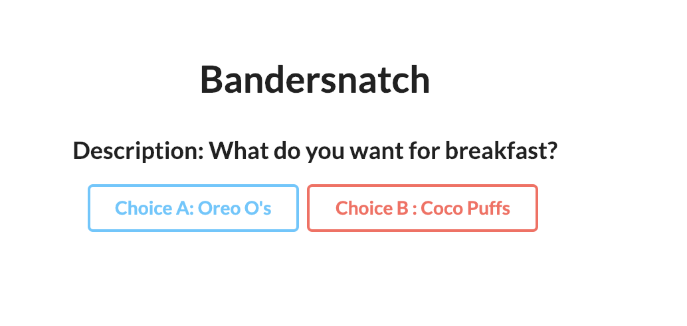
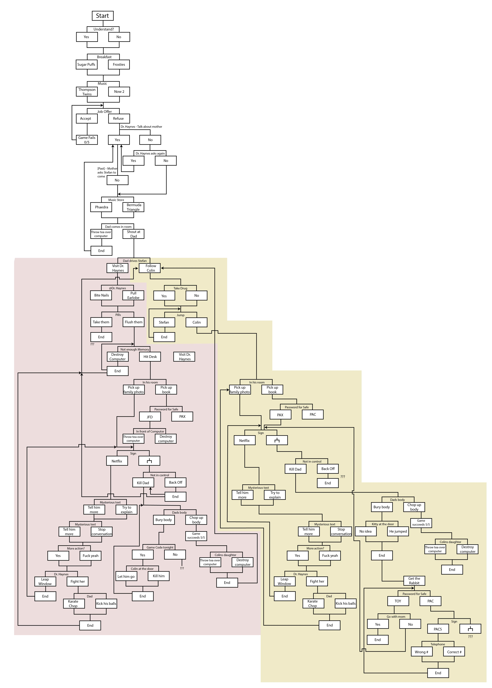
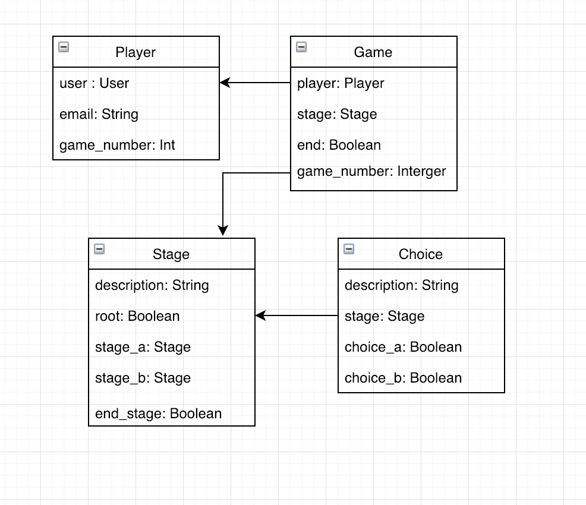

# Bandersnatch

### What is Bandersnatch?

Black Mirror: Bandersnatch is a 2018 interactive film in the science fiction anthology series Black Mirror. It was written by series creator Charlie Brooker and directed by David Slade. Netflix released the standalone film on 28 December 2018.

In Bandersnatch, viewers make decisions for the main character, the young programmer Stefan Butler (Fionn Whitehead) who is adapting a fantasy choose-your-own-adventure novel into a video game in 1984. Other characters include Mohan Thakur (Asim Chaudhry) and Colin Ritman (Will Poulter), both of whom work at a video game company, Butler's father, Peter (Craig Parkinson) and Butler's therapist, Dr. Haynes (Alice Lowe). The film is based on a planned Imagine Software video game of the same name which went unreleased after the company filed for bankruptcy. It also alludes to Lewis Carroll's own works that feature the bandersnatch creature. A piece of science fiction and horror, Bandersnatch incorporates meta-commentary and rumination on free will.

### What is this? 
A re-make of netflix's bandersnatch game as a web app created with Django. This is essentially a choose your own adventure book. All of the paths are based around netflix show black mirrow episode "Bandersnatch". This currently comes pre-loaded with one story that I created. a future feature set will be to give users the ability to create their own stories. 

### Getting Started
- Make sure you have [python3](https://www.python.org/download/releases/3.0/) installed on your machine and [pip](https://pip.pypa.io/en/stable/installing/)
- From the root directory run `source env/bin/activate`
- Get into the retro folder `cd retro` and then `python3 manage.py runserver`
- Navigate to `http://localhost:8000/` to create a user and play Bandersnatch
- You then should see this after you create your user !

### Possible Paths

These are the inspiration to all the possible [paths](https://www.polygon.com/2018/12/29/18159525/black-mirror-bandersnatch-all-endings-guide-netflix) in the game

### Personalizing 
- Feel free to fork this project and create your own stories! The database model is the image below. To add new stages think of it as a binary tree.

 
### Planned Features
- Create a story dashboard for admin
- Host on Heroku
- Need to add test uwu
 
<!--
## To Do 
- Get Next stage to work
- Render page after update

### Usefull Development Commands 
- `source env/bin/activate`
- `python3 manage.py runserver`
- `python3 manage.py makemigrations`
- `python3 manage.py migrate`

### Admin User 
- User: `andybui`
- Password: `password2018`
-->

 
